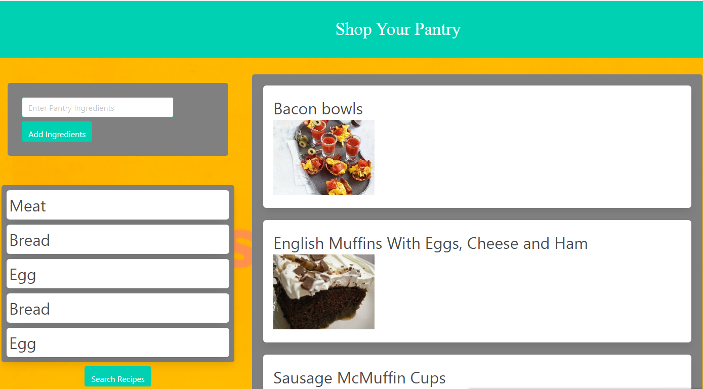

# Portfolio

## Description 

This is a Portfolio that I'm creating. Basically, it gives the user who might be the employer, customer, or anybody the possibility to go to my website and learn more about who I am, my accomplishments, projects, contact informations, GitHub account, resume, LinkedIn account and so on.

Thus, the user will be able to see my home page that includes some general informations about me, such as my name, who I am, what I'm looking for, a link to my resume and so on. In addition, the user will be able to click on my project page, which will display all the projects that I have done, with screen shots, a link to gitHub repository page, and a link to deployed application. Moreover, the user will be able to click on my contact page and access to my personal informations such as phone number, email account, LinkedIn account, GitHub account.

## Project1 Title: Password Generator

## Link to the deployed version
https://charles198618.github.io/passwordgenerator/

## Link to the GitHub repository
https://github.com/charles198618/passwordgenerator

## Screenshot of the deployed application

## Project2 Title: Shop Your Pantry

## Link to the deployed version
https://caitlin-emily.github.io/shopYourPantry/

## Link to the GitHub repository
https://github.com/caitlin-emily/shopYourPantry

## Screenshot of the deployed application

## OBJECTIVES

The motivation that pushed me to realize this project is because I wanted to showcase my skills. I wanted to show to the world, the employer, customer, or anybody, what I'm capable of, as a full stack web developer. In addition, I wanted to show a potential employer that I have learned the skills required to be a successful software engineer. Moreover, I wanted to show to my customer that they can count on me to deliver a professional website or application for their businesses.

## Languages used

In order to get to this result, I have use HTML, CSS, and JavaScript. First of all, we can think about HTML as a body. it stands for Hypertext Markup Language. Basically, it is a language that we can use to create web pages. Thus every single on internet is written using HTML. Moreover, it includes elements on the pages, images on the pages, the orders of the appearance of elements and so on. Secondly, we have CSS that stands for Cascading Style Sheet. It is used to make our website beautiful. It's used to define the cell padding of table cells, the style, the thickness, and color of a table's border, and the padding around images or other objects. The third most important element to point out is JavaScript. It is a pragramming language like Java, PHP, Python, C++. It's considered as the brain in human body. It allows us to implement complex features on web pages, animated graphics, interactive maps and so on.  It's with JavaScript that we have succeded to make this project work.

## Team members

The second project was an application, that was developed by the Mighty Bluejays team, consisting of four team members:
* Oliver, @acbewley
* Charles, @charles198618
* Courtney, @CFox2019
* Caitlin, @caitlin-emily

## Challenges met

There was many challenges during the realization of this project. The big obstacle was how to display all the links. Also some styling with CSS was another challenge, but I was able to fix the issue and make it look nice as I wanted.
